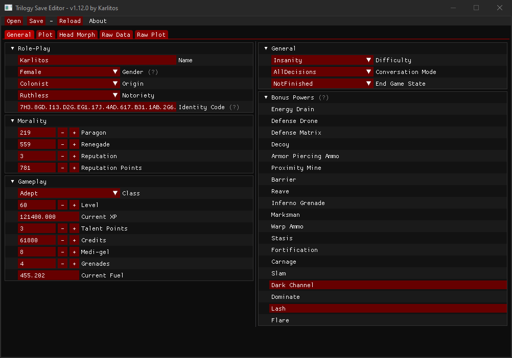

# Trilogy Save Editor
A save editor for Mass Effect Trilogy (and Legendary)



## Features
This software is similar to Gibbed's save editors (and forks) but adds a lot of stuff.

- Mass Effect 1 (yay!) with about a hundred plots.
- A lot of new plots for ME2/3 (including N7 and DLC Weapons)
- Multiple bonus powers support for ME2/3
- Some fixes (ME2 Squad appearance)
- Mass Effect Legendary support
- Free (as freedom) and open-source software with [CeCILL license](https://en.wikipedia.org/wiki/CeCILL)

The goal was to have an editor for all 3 games before the Legendary Edition was released. That's done.

## Frequently Asked Questions
You can read the [FAQ here](https://github.com/KarlitosVII/trilogy-save-editor/wiki/Frequently-Asked-Questions).

## Command line usage
```
USAGE:
    trilogy_save_editor(.exe) [FLAGS] [OPTIONS] [SAVE]

FLAGS:
        --dx11       Use DirectX 11 backend (Windows)
        --dx12       Use DirectX 12 backend (Windows)
    -h, --help       Prints help information
        --metal      Use Metal backend (MacOS)
    -V, --version    Prints version information
        --vulkan     Use Vulkan backend

OPTIONS:
    -c, --compare <OTHER_SAVE>    Compare `SAVE` and `OTHER_SAVE` plots and 
                                  generate a `compare_result.ron` (Rusty
                                  Object Notation) file

ARGS:
    <SAVE>    Mass Effect save file
```

## Acknowledgments

- The whole ME3Explorer team (https://github.com/ME3Explorer/ME3Explorer)
- Gibbed (https://github.com/gibbed)
- Bioware / EA (https://github.com/electronicarts/MELE_ModdingSupport)

I spent days digging into their code to figure out how to parse Mass Effect saves. Without them I could not have done anything.
