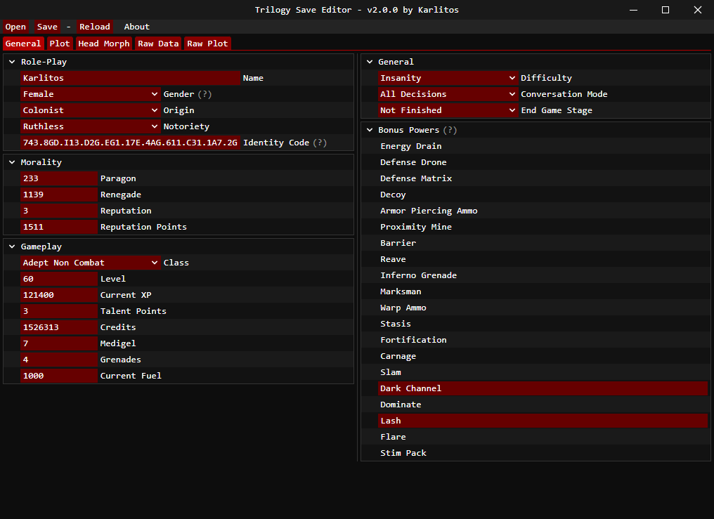

# Trilogy Save Editor
A save editor for Mass Effect Trilogy (and Legendary)



## Features
This software is similar to Gibbed's save editors (and forks) but adds a lot of stuff.

- Support for the 2 Mass Effect Trilogies (Original and Legendary)
- 100% of the saves can be edited (except ME1OT)
- Thousands of plot flags
- Bioware's plot database
- Import / Export head morph
- ME1LE inventory management
- Multiple bonus powers for ME2/3
- Xbox 360 and PS4 support
- Free (as freedom) and open-source software with [CeCILL license](https://en.wikipedia.org/wiki/CeCILL)

## Frequently Asked Questions
You can read the [FAQ here](https://github.com/KarlitosVII/trilogy-save-editor/wiki/Frequently-Asked-Questions).

## Command line usage
```
USAGE:
    trilogy_save_editor(.exe) [FLAGS] [SAVE]

FLAGS:
    -h, --help       Prints help information
    -V, --version    Prints version information

ARGS:
    <SAVE>    Mass Effect save file
```

## Acknowledgments

- The whole ME3Explorer team (https://github.com/ME3Explorer/ME3Explorer)
- Gibbed (https://github.com/gibbed)
- Bioware / EA (https://github.com/electronicarts/MELE_ModdingSupport)

Without them I could not have done anything.


## Compile from source

```sh
rustup target add wasm32-unknown-unknown
npm update
cargo install cargo-make
cargo make release
```
